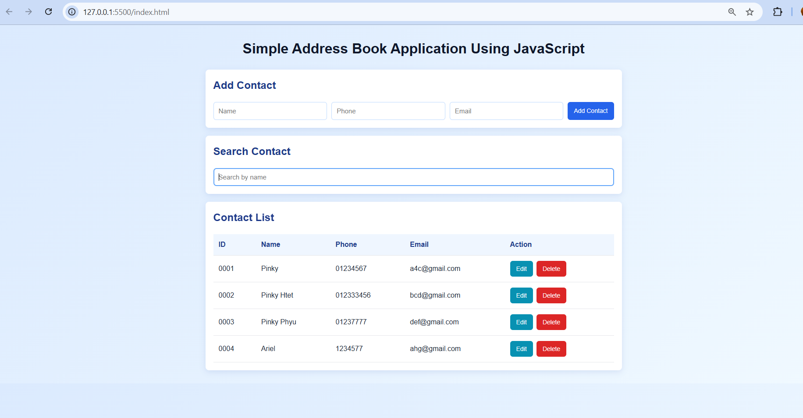

# Simple Address Book Application Using JavaScript

## Objective
A simple Address Book application using plain JavaScript. All data is stored in memory using an array. No backend, database, framework, or external library is used. Can edit, search, view and delete contacts.

## Live Demo
https://khinphyucinhtet.github.io/address_book_sample/

## GitHub Repository
https://github.com/khinphyucinhtet/address_book_sample

## Features
- Add contact
- View contacts in a table
- Search contact by name
- Edit contact name, phone, and email
- Delete contact by id

## Data Structure
Each contact has:
- id as a number
- name as a string
- phone as digits with at least 7 numbers
- email in email format

## Sample Contacts for Viewing 
| ID | Name | Phone | Email |
| --- | --- | --- | --- |
| 0001 | Pinky | 01234567 | abc@gmail.com |
| 0002 | Pinky Htet | 012333456 | bcd@gmail.com |
| 0003 | Pinky Phyu | 01237777 | def@gmail.com |

## Technologies Used
- HTML
- CSS
- JavaScript

## Screenshot

## Note
The contacts are stored only in browser memory. If the page is refreshed, the app returns to the sample contacts.
